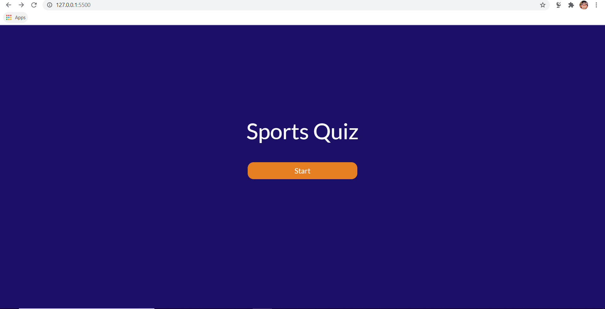
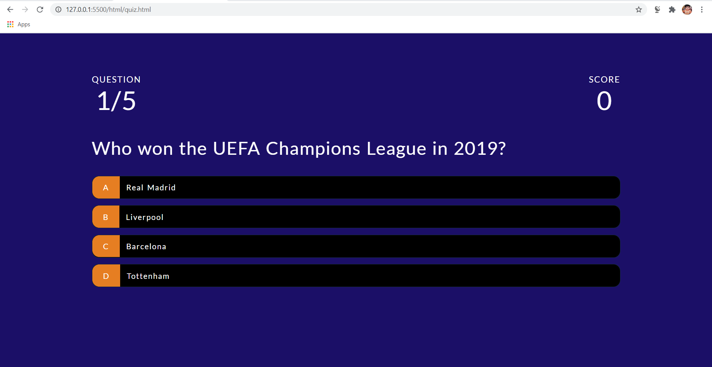
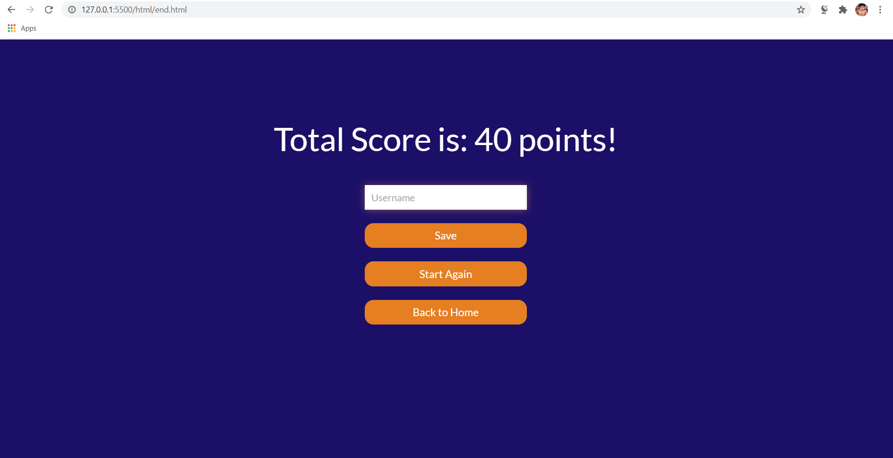
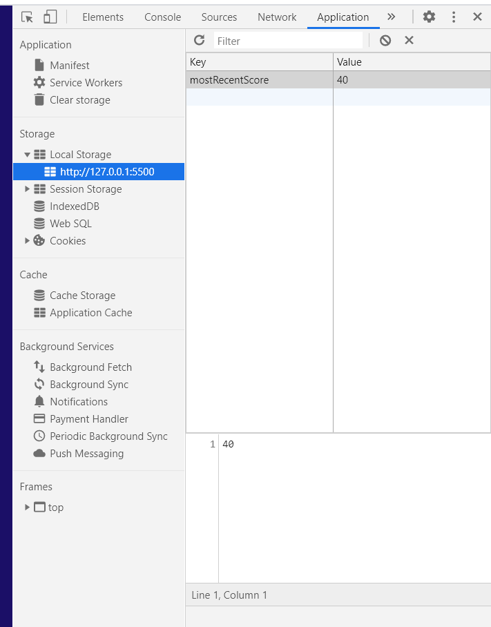

# QuizProjectJSON
* It is an Online Test Application system that enables users to give online tests, review their answers, and check their results.
* This system contains three main modules: Quiz, Review, and Result. The quiz section of the online test application accepts the questions in JSON format. The JSON file can be easily shared from the server in the pre-defined format. The application renders the test at the client-side.
* And the Review and Results section shows the feedback regarding the correct or incorrect answers and at the end it shows final result.

### Technologies used:
* HTML and CSS
* JavaScript
* JSON

### Steps:
* Its a Sports Quiz and user can start with the quiz by pressing on start button on index.html.
* It contains set of questions which users can answer and has an easy difficulty questions related to sports.
* As soon as the user press an option for a question, they can get the feedback that it is a correct or an incorrect answer by displaying the option green or red respectively.
* The set of questions are stored in questions.json file and they are fetched in the site via Fetch API.
* We need to be serving our index.html locally or on a live server somewhere for the Fetch API to work properly. We can install its extension on VS Code and open the files on Live Server from VS Code itself.
* The Final score is shown at the end by fetching it from Local Storage via localStorage.getItem() function and before that it is stored locally via localStorage.setItem() function.

#### Note: 
Without the use of server, the questions from the json file wont load. So, it is mandatory to use some sort of local hosting server and then open the files and not without that. In our case we are using Live Server extension from VS code.

<kbd></kbd>

<kbd></kbd>

<kbd></kbd>

<kbd></kbd>

<kbd></kbd>

<kbd></kbd>

